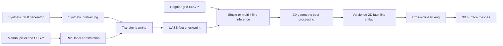

# Geometry-constrained deep learning for 3D thrust-fault interpretation

Code accompanying the manuscript:

> **Geometry-constrained deep learning for 3D thrust fault interpretation in seismic reflection data**  
> Wenhao Zheng, Rebecca E. Bell, Carlos Cueto, Lluis Guasch, Cédric M. John, Polina Pasalska, and Yanghua Wang

The manuscript version used as the reference for this repository is
[`JGR_thrust_faults_v3.pdf`](JGR_thrust_faults_v3.pdf), SHA-256:

```text
3a33b359164a78ac50bf36246552a634fe4cbed7e1028a2872832e63547dcc17
```

## Repository status and scope

This directory contains the core computational workflow from synthetic-data
generation and real-label construction through UASS-Net training, 2D
probability inference and geometric post-processing, multi-inline export, and
3D fault-line linking and surface-mesh generation.

The current snapshot is **not yet a self-contained archival reproduction** of
the complete paper:

- the NZ3D SEG-Y data and manual interpretation CSV files are not distributed
  here;
- the exact five-inline input configuration and fixed 200/40 real-data split
  are not included;
- Sections 5.2 and 5.3 quantitative analyses and Table 2 generation are not
  implemented; and
- several implementation choices are more specific than, or differ from, the
  current v3 manuscript. They are listed in
  [Implementation and manuscript notes](#implementation-and-manuscript-notes).

Publication-figure scripts are outside the current scope. They are not needed
to run the core method.

## Workflow



## Files

| File | Purpose |
|---|---|
| `generate_synthetic_thrust_data_with_planar_gaussian.py` | Generate synthetic seismic-label pairs. |
| `construct_real_seismic_labels.py` | Convert manual interpretations and real SEG-Y sections into transfer-learning patches. |
| `train_uassnet_article.py` | Define UASS-Net; run synthetic training, transfer learning, sanity checks, and single-patch prediction. |
| `model_real.pth` | Bundled reference raw state dictionary used by the current notebook and regression workflow. |
| `requirements.txt` | Pinned direct Python dependencies for the tested environment. |
| `LICENSE` | MIT license for the source code. |
| `CITATION.cff` | Machine-readable software and manuscript citation metadata. |
| `ASSET_LICENSES.md` | Licensing and provenance status for weights, data, derived products, and the manuscript. |
| `MODEL_CARD.md` | Technical, provenance, limitation, and licensing record for `model_real.pth`. |
| `demo/fault_process_2d_end_to_end_github.ipynb` | Self-contained illustrated inline-600 inference and 2D-processing example. |
| `fault_process_2d_end_to_end.py` | Importable and command-line single-inline inference and complete 2D post-processing. |
| `fault_process_multi_inline.py` | Stream multiple SEG-Y inlines and export the versioned 2D-to-3D artifact. |
| `fault_surface_reconstruction_3d.py` | Link 2D fault lines across sections and generate 3D surface meshes. |
| `demo/visualize_fault_surfaces_3d.py` | Normalize current or legacy 3D surface artifacts and render 3D, map, and SEG-Y inline-overlay views. |
| `JGR_thrust_faults_v3.pdf` | Current manuscript reference used by this code snapshot. |

## Installation

Python 3.10 or newer is required because the code uses Python 3.10 type-union
syntax; Python 3.11 is recommended for the pinned environment. Create an
environment and install the dependencies with:

```bash
python -m venv .venv
source .venv/bin/activate
python -m pip install --upgrade pip
python -m pip install -r requirements.txt
```

`requirements.txt` records PyTorch 2.1.0. If a specific CPU or CUDA wheel is
needed, install that PyTorch 2.1.0 build first; the subsequent requirements
command will keep a compatible installed build.

The current development environment used for the latest checks was:

| Package | Version |
|---|---:|
| Python | 3.11.5 |
| PyTorch | 2.1.0+cu121 |
| NumPy | 1.26.0 |
| SciPy | 1.11.3 |
| pandas | 2.1.2 |
| scikit-learn | 1.3.2 |
| matplotlib | 3.8.0 |
| segyio | 1.9.11 |
| tqdm | 4.65.0 |

`requirements.txt` pins the direct dependencies used by the repository. It
does not lock the operating system, GPU driver, CUDA runtime, or every
transitive dependency. Add an `environment.yml` or platform-specific lock file
only if that additional level of archival reproducibility is required.

Run all commands below from this directory unless stated otherwise:

```bash
cd /path/to/repository/Best
```

## Quick checks without external data

Check the network input/output contract on CPU:

```bash
python './train_uassnet_article.py' --mode sanity --device cpu
```

Expected network dimensions and parameter count:

```text
Input shape:  (2, 1, 256, 256)
Output shape: (2, 1, 256, 256)
Parameters:   5,789,423
```

Run the data-independent 3D formula and trajectory tests:

```bash
python './fault_surface_reconstruction_3d.py' --self-test
```

A successful run ends with:

```text
INFO All synthetic self-tests passed.
```

Passing these checks verifies internal code invariants only. It does not
validate real-data inference or reproduce the manuscript results.

## Input data

### SEG-Y

The inference code expects a regular-grid SEG-Y volume that can be addressed
through `segyio.iline`. The code streams one inline at a time and does not load
the complete survey into memory.

The reference inline-600 regression input used during development has SHA-256:

```text
87ed66c6c91839661bf4a7a765175cbd332e0922ce85d63c09b44b91539ff785
```

That file is not included. A different SEG-Y file can be processed normally,
but it cannot pass the exact inline-600 reference validation.

Before publication, the data documentation should identify the authorized
NZ3D download source, DOI, SEG-Y filename and checksum, inline/crossline/sample
header convention, coordinate units, and redistribution terms.

### Manual interpretations

Real-label construction requires CSV fault picks and the coordinate transform
from CSV coordinates to image indices. For the manuscript workflow, the input
configuration should contain inlines 30, 230, 430, 630, and 830.

The real SEG-Y files, interpretation CSV files, exact coordinate configuration,
and fixed 200/40 split manifest are not included in this directory.

## 1. Generate synthetic data

Generate a small installation-test dataset:

```bash
python './generate_synthetic_thrust_data_with_planar_gaussian.py' \
  --out ./synthetic_demo \
  --num-train 8 \
  --num-val 2 \
  --height 256 \
  --width 256 \
  --seed 2026 \
  --preview 2
```

Generate 12,000 training and 2,000 validation samples with the **current
implementation defaults**:

```bash
python './generate_synthetic_thrust_data_with_planar_gaussian.py' \
  --out ./synthetic_thrust_data_v3 \
  --num-train 12000 \
  --num-val 2000 \
  --height 256 \
  --width 256 \
  --min-faults 1 \
  --max-faults 3 \
  --seed 2026
```

The generator writes:

```text
synthetic_thrust_data_v3/
├── config.json
├── train/
│   ├── seismic/*.npy
│   ├── labels/*.npy
│   └── metadata/*.json
└── val/
    ├── seismic/*.npy
    ├── labels/*.npy
    └── metadata/*.json
```

Planar and Gaussian background deformation are enabled by default in the
current generator. They can be disabled with:

```text
--no-planar-background --no-gaussian-background
```

See the manuscript-alignment note below before deciding which setting should
define the archival paper configuration. The v3 text does not describe these
two background-deformation stages, so the default command above must not be
described as an exact v3 data reproduction. Even with both stages disabled,
the current reflectivity generator applies a mild lateral-amplitude variation
that is not specified in v3.

## 2. Construct real training labels

Create a JSON list containing one entry per interpreted line. The following is
a minimal schema example, **not** the manuscript coordinate configuration:

```json
[
  {
    "inline_id": 30,
    "segy_path": "/absolute/path/to/inline_or_volume.segy",
    "csv_path": "/absolute/path/to/inline30_picks.csv",
    "section_index": 0,
    "x_col": 0,
    "z_col": 1,
    "fault_id_col": 2
  }
]
```

Add the verified `x_offset`, `z_offset`, `x_scale`, `z_scale`,
`label_shape_before_downsample`, `downsample_x`, and `downsample_z` values for
each real line. `inline_id` is written to metadata; it does not select a SEG-Y
header. `section_index` selects a positional section in the array read from the
specified SEG-Y file and must therefore be mapped explicitly to the intended
inline. The current loader clips an out-of-range section index to a valid
array index, so verify this mapping rather than relying on that fallback.

The CSV must contain a header row because it is read with the default
`pandas.read_csv` behavior. Verify every coordinate transform and shape
against the actual data, then run:

```bash
REAL_LINES_CONFIG=/absolute/path/to/real_lines_v3.json
test -f "$REAL_LINES_CONFIG"

python './construct_real_seismic_labels.py' \
  --config-json "$REAL_LINES_CONFIG" \
  --dilation-a 8 \
  --dilation-c 4 \
  --patch-size 256 \
  --stride 128 \
  --target-train 200 \
  --target-val 40 \
  --seed 2026 \
  --out ./real_thrust_fault_labels_v3
```

If `fault_id_col` is supplied, points with the same fault ID are connected as
a polyline. Without a fault-ID column, use `--connect-without-fault-id` only
when the CSV contains one correctly ordered fault line. By default, patches
without a labeled pixel are excluded; `--include-background` changes this
behavior and therefore changes the training dataset.

Both generated datasets use the directory contract expected by the training
loader:

```text
DATA_ROOT/
├── train/
│   ├── seismic/*.npy
│   └── labels/*.npy
└── val/
    ├── seismic/*.npy
    └── labels/*.npy
```

Seismic and label filenames must have the same sorting order, and each array
must have shape `256 x 256`. Use `.npy` for the current end-to-end training
path; the optional real-label `.dat` writer and the training `.dat` label
reader do not currently use the same label dtype.

Always write generated datasets to a new, empty output directory. The
generation scripts do not remove stale files, so reusing a populated directory
can silently add old samples to a later training run. If fewer than 240 usable
real patches are available, the label script falls back to an approximately
80/20 split; if more are available, it retains a seeded subset. For the paper
protocol, confirm that the terminal output is exactly:

```text
Train patches: 200
Validation patches: 40
```

## 3. Train UASS-Net

### Synthetic pretraining

```bash
python './train_uassnet_article.py' \
  --mode synthetic \
  --data-root ./synthetic_thrust_data_v3 \
  --out-dir ./uassnet_outputs/synthetic \
  --file-ext .npy \
  --epochs 66 \
  --batch-size 16 \
  --lr 1e-3 \
  --step-size 20 \
  --gamma 0.1 \
  --base-channels 16 \
  --dropout 0.2 \
  --patch-size 256 \
  --seed 2026
```

The best checkpoint is written to:

```text
uassnet_outputs/synthetic/uassnet_synthetic_best.pth
```

### Transfer learning

Manuscript v3 fine-tunes the encoder, ASPP bottleneck, decoder, and output
layer. Therefore, do **not** pass `--freeze-encoder` for the paper protocol.

```bash
python './train_uassnet_article.py' \
  --mode transfer \
  --data-root ./real_thrust_fault_labels_v3 \
  --out-dir ./uassnet_outputs/transfer \
  --file-ext .npy \
  --pretrained ./uassnet_outputs/synthetic/uassnet_synthetic_best.pth \
  --epochs 50 \
  --batch-size 16 \
  --lr 1e-5 \
  --step-size 20 \
  --gamma 0.1 \
  --base-channels 16 \
  --dropout 0.2 \
  --patch-size 256 \
  --seed 2026
```

The best checkpoint is written to:

```text
uassnet_outputs/transfer/uassnet_transfer_best.pth
```

The current CLI does not require `--pretrained` in transfer mode. Omitting it
starts from random initialization at the transfer-learning rate and does not
reproduce the manuscript protocol.

## 4. Use the bundled checkpoint

The bundled file `model_real.pth` is the raw PyTorch state dictionary used
by the current notebook and reference-regression workflow. Because it contains
parameters only, the file itself does not record the training epoch, data
version, validation loss, preprocessing, or non-parametric operations such as
the interpolation mode. It loads strictly into the following current model
definition:

```text
input/output channels: 1 / 1
base channels:         16
decoder dropout:       0.2
decoder upsampling:    nearest-neighbor
```

SHA-256:

```text
d154ab68869cfc9c789b94835cb2614c182c7dd0fa3fd56cf2af4bb9b2b638aa
```

Predict one `256 x 256` `.npy` or float32 `.dat` patch:

```bash
PATCH_FILE=/absolute/path/to/seismic_patch.npy
test -f "$PATCH_FILE"

python './train_uassnet_article.py' \
  --mode predict \
  --checkpoint './model_real.pth' \
  --patch "$PATCH_FILE" \
  --out-dir ./patch_predictions \
  --base-channels 16 \
  --dropout 0.2 \
  --patch-size 256
```

The output is `patch_predictions/<input_stem>_probability.npy`.

This single-patch command min-max normalizes the patch to `[0,1]`. The SEG-Y
pipeline below instead min-max normalizes the whole processed section and then
z-score standardizes each overlapping patch. The two commands are therefore
different inference entry points and should not be expected to produce
identical model inputs.

## 5. Process one SEG-Y inline

`fault_process_2d_end_to_end.py` reads one inline, predicts a probability map
by overlapping-patch inference, applies the complete reference 2D
post-processing sequence, and returns interpolated fault-line clusters.

```bash
INPUT_SEGY=/absolute/path/to/regular_grid_volume.segy
INLINE_NUMBER=600
test -f "$INPUT_SEGY"

python fault_process_2d_end_to_end.py \
  "$INPUT_SEGY" \
  './model_real.pth' \
  --inline "$INLINE_NUMBER" \
  --crossline-stride 2 \
  --sample-stride 2 \
  --device auto \
  --output-npz inline600_fault_lines.npz
```

The NPZ output is preferred for a single inline. It contains `points`,
`cluster_ids`, `point_offsets`, and `point_columns`. It does not contain inline
mapping, sampled SEG-Y axes, or a provenance manifest. Point coordinates are
processed-array indices in `(profile_index, sample_index)` order, not SEG-Y
header or physical coordinates.

The single-inline CLI also accepts `--output-pickle`, but that legacy file has
the root structure `{cluster_id: points}` and is **not** the versioned
multi-inline `line_n` artifact expected by the 3D CLI. Use
`fault_process_multi_inline.py` to create a direct 3D input.

The single-inline CLI exposes strides, device, output, and reference-validation
controls. To change patch overlap or 2D post-processing thresholds, call the
Python API with explicit `InferenceConfig` and `PostprocessConfig` objects. The
multi-inline CLI supports corresponding JSON configuration files.

Programmatic use:

```python
from fault_process_2d_end_to_end import process_single_inline

result = process_single_inline(
    segy_path="/path/to/regular_grid_volume.segy",
    weights_path="./model_real.pth",
    inline_number=600,
    crossline_stride=2,
    sample_stride=2,
    device="auto",
)
clusters = result.clusters_for_3d()
```

### Exact inline-600 regression check

Use this option only with the exact reference SEG-Y and bundled checkpoint:

```bash
REFERENCE_SEGY=/absolute/path/to/reference_volume.segy
test -f "$REFERENCE_SEGY"

python fault_process_2d_end_to_end.py \
  "$REFERENCE_SEGY" \
  './model_real.pth' \
  --inline 600 \
  --crossline-stride 2 \
  --sample-stride 2 \
  --device auto \
  --validate-inline600-reference
```

The check verifies the two file hashes, probability-map shape `(2080, 1001)`,
and recorded intermediate and final stage counts. It is an implementation
regression test for the reference inputs, not a general validation mode.

### Important 2D defaults

| Stage | Current code default |
|---|---:|
| Crossline stride / sample stride | `2 / 2` |
| Patch shape / overlap | `256 x 256 / 12` pixels |
| Candidate probability threshold | `0.1` |
| Gradient threshold | `0.10` of section maximum |
| Gradient-normal sampling step | `1.0` pixel |
| Ridge support radius / minimum retained ratio | `8 / 0.999` |
| Two-pass gap grouping | `20` pixels |
| First DBSCAN `(eps, MinPts)` | `(10, 5)` |
| Curvature `tau / delta` | `0.5 / 1e-3` |
| Curvature local/smoothing windows | `7 / 5` |
| Curvature blend / maximum shift | `0.01 / 0.05` pixels |
| Three-point removal rule / maximum rounds | remove `<90 degrees` / `10` |
| Second DBSCAN `(eps, MinPts)` | `(10, 3)` |
| Merge angle / distance / extrapolation | `17 degrees / 75 px / 8 px` |
| Final cluster minimum points / vertical range | `30 / >30` pixels |

The second DBSCAN removes points labeled `-1`; surviving points retain their
first-DBSCAN labels for merging. Curvature smoothing and the three-point angle
filter are applied before the second DBSCAN and again after cluster merging and
large-cluster selection.

## 6. Process multiple inlines and export the 2D-to-3D artifact

The following reduced 300-330 example loads the model once and streams the
selected SEG-Y inlines:

```bash
INPUT_SEGY=/absolute/path/to/regular_grid_volume.segy
test -f "$INPUT_SEGY"

python fault_process_multi_inline.py \
  "$INPUT_SEGY" \
  --model-weights './model_real.pth' \
  --inline-origin 300 \
  --inline-start 300 \
  --inline-end 330 \
  --inline-step 1 \
  --crossline-stride 2 \
  --sample-stride 2 \
  --patch-shape 256 256 \
  --overlap 12 \
  --device auto \
  --output-pickle fault_lines_2d_300_330.pkl \
  --deterministic
```

This creates:

```text
fault_lines_2d_300_330.pkl
fault_lines_2d_300_330.metadata.json
```

The 300-330 range is a smoke-test range; Figure 13 in the manuscript uses
inline 300-400.

The trusted pickle has a strict data-only structure:

```python
{
    "line_0": {0: array_of_shape_N_by_2, ...},
    "line_1": {0: array_of_shape_M_by_2, ...},
    # ...
}
```

The JSON sidecar records schema `fault-lines-2d/1.0`, the authoritative inline
mapping, coordinate convention, native and processed axes, parameters,
per-section counts, software versions, provenance, and the pickle SHA-256.
The mapping is

```text
inline_number = inline_origin + line_index * inline_step
```

Selected inlines must align with that origin and step. If missing inlines are
allowed, the resulting `line_n` keys can be sparse; they must not be
renumbered because the key index carries spatial meaning.

By default, the command hashes the input SEG-Y, which can take time for a large
volume. `--skip-input-sha256` disables that provenance check. Existing output
files are not replaced unless `--overwrite` is supplied.

The batch CLI also checks the model against the bundled reference SHA-256 by
default. When using a newly trained checkpoint, either pass its expected digest
with `--expected-model-sha256 DIGEST` or intentionally disable this identity
check with:

```text
--expected-model-sha256 ""
```

The latter should be used only for a trusted checkpoint whose provenance is
recorded separately.

> **Pickle security:** loading a Python pickle can execute arbitrary code. Use
> the artifact only when it was generated locally or obtained from a trusted
> source. A matching sidecar hash verifies integrity, not authorship.

## 7. Reconstruct 3D fault surfaces

Run the 3D stage on the paired artifact generated above:

```bash
python './fault_surface_reconstruction_3d.py' \
  fault_lines_2d_300_330.pkl \
  --output-dir fault3d_output_300_330 \
  --allow-unsafe-pickle
```

The sidecar is discovered automatically. The output directory must be new or
empty.

The 3D code implements:

1. symmetric 3D Chamfer distance and PCA orientation similarity;
2. candidate scoring with `wd=0.03`, `wtheta=1.0`, `M=5`, and `tau=0.7`;
3. deterministic best-match selection and `K=3` consecutive-section
   validation;
4. normalized-arc-length resampling;
5. linear cross-inline interpolation and Gaussian smoothing; and
6. triangular surface generation.

Important implementation defaults that are not fully specified by the
manuscript are:

| Setting | Default |
|---|---:|
| Samples along each resampled 2D line | `128` |
| Gaussian sigma along inline axis | `1.0` |
| Gaussian sigma along fault-line axis | `1.0` |
| Observed-line blending weight | `0.25` |

### 3D outputs

| File | Contents |
|---|---|
| `candidate_scores.csv` | Exactly evaluated candidate pairs, geometry, similarity, and selection flags. |
| `selected_links.csv` | Links retained after source-best and target-collision selection. |
| `track_membership.csv` | Ordered 2D line membership of validated tracks. |
| `tracks.json` | Track topology and minimum/mean link similarity. |
| `fault_surfaces.npz` | Flat surface vertices, global triangular faces, offsets, grid shapes, and, when surfaces exist, observation RMSE. |
| `run_metadata.json` | Provenance, parameters, implementation notes, counts, software, and output schema. |

Surface vertices are stored as:

```text
(inline_number, processed_profile_pixel, processed_depth_or_time_pixel)
```

The NPZ keys are `surface_ids`, `vertices`, `vertex_offsets`, `faces`,
`face_offsets`, and `grid_shapes`; `observation_rmse` is present when at least
one surface exists. Each interval in `vertex_offsets` and `face_offsets`
belongs to the corresponding `surface_id`. `faces` contains global indices into
the concatenated `vertices` array.

Matching coordinates are

```text
(inline_number - inline_origin, profile_index, sample_index) * axis_scales
```

`--axis-scales SECTION PROFILE DEPTH` therefore changes both Chamfer distance
and PCA orientation during matching. The loader does not replace these indices
with SEG-Y X/Y/time/depth axis values, even though the batch sidecar records
axis summaries. The option also does not convert exported vertices to physical
survey coordinates. Such conversion must use the SEG-Y geometry and sample
metadata separately.

### Visualize and normalize 3D surfaces

The standalone viewer accepts the current `fault_surfaces.npz` schema and
older already-gridded pickles containing `grid_x/grid_y/grid_z` plus an
optional `grid_z_org`. The following command reproduces the local 400--500
demo using the supplied `grid_z` surface field:

```bash
python demo/visualize_fault_surfaces_3d.py \
  demo/outputs_400_500.pkl \
  --input-format legacy-grid-pickle \
  --allow-legacy-pickle \
  --segy 'demo/demo data/400_500.segy' \
  --inline-origin 400 \
  --crossline-stride 2 \
  --sample-stride 2 \
  --z-field grid_z \
  --vertical-unit m \
  --inline-slices 400 450 500 \
  --output-dir demo/fault3d_demo_400_500_reproduced
```

The explicit stride values record the legacy processing relation to the native
SEG-Y grid. The viewer uses a restricted NumPy-only unpickler, validates every
surface and coordinate bound, and streams only the requested SEG-Y inlines.
It does not load the complete volume or rerun an already-gridded legacy result
through the current reconstruction algorithm.

The supplied legacy pickle does not contain `grid_z_org` and uses NaN outside
each interpolated surface's support. The viewer preserves those nodes as
no-data holes, writes a `vertex_valid` mask, and omits triangles touching an
invalid node instead of filling unsupported regions.

For a current `fault_surfaces.npz`, the viewer automatically reads the sibling
`run_metadata.json`, verifies its recorded crossline/sample processing strides,
and preserves the input triangle topology and `observation_rmse`. If that
sidecar is unavailable, both strides must be supplied explicitly.

The demo writes:

| File | Contents |
|---|---|
| `fault_surfaces_oblique.png` | Oblique 3D view of all surfaces. |
| `fault_surfaces_map_view.png` | Inline/crossline map colored by vertical coordinate. |
| `inline_0400_overlay.png`, etc. | Selected seismic sections with surface intersections. |
| `surfaces_normalized.npz` | Full-resolution, non-object vertices, validity mask, filtered faces, offsets, and grid shapes. |
| `surface_inventory.csv` | Per-surface geometry and coordinate ranges. |
| `inline_intersections.csv` | Points used in the seismic overlays. |
| `visualization_metadata.json` | Input hashes, SEG-Y geometry, coordinate mapping, software, warnings, and output hashes. |

The 3.23-GiB `400_500.segy` file exceeds standard GitHub file limits and should
be hosted in a data repository (or managed with Git LFS) rather than committed
as a normal Git object. The generated PNG previews and normalized NPZ are small
enough for an ordinary repository.

## Implementation and manuscript notes

The following points must be resolved or explicitly disclosed before describing
this snapshot as an exact implementation of manuscript v3.

### Network, training, and inference

- Manuscript v3 and the current training and inference architecture used with
  the bundled state dictionary use nearest-neighbor decoder upsampling. The
  raw state dictionary itself does not encode this non-parametric operation.
- Figure 2 describes five down/up-sampling stages, whereas the code contains
  five encoder feature levels, four pooling operations, and four decoder
  upsampling blocks.
- The synthetic generator enables planar and Gaussian background deformation
  by default, but those steps are not described in the v3 synthetic-data
  sequence.
- Training and single-patch prediction min-max normalize each patch to `[0,1]`.
  The end-to-end SEG-Y path first min-max normalizes the section and then
  z-score standardizes each inference patch. These paths therefore do not
  provide identical input distributions.
- The transfer CLI permits omission of `--pretrained` and optionally permits
  encoder freezing. Manuscript-v3 reproduction requires a synthetic pretrained
  checkpoint and all network components trainable.

### 2D post-processing

- Section 4.1 describes extracted narrow ridge points entering the first
  DBSCAN. The reference code applies a weak ridge-support constraint retaining
  at least 99.9% of probability-threshold candidates and two `gap=20` grouping
  passes before DBSCAN.
- The initial `probability > 0.1` candidate threshold is an implementation
  parameter that is not stated explicitly in Section 4.1.
- The second DBSCAN uses v3 values `(eps=10, MinPts=3)` and removes label `-1`,
  but first-DBSCAN labels are retained for subsequent merging. V3 also calls
  the second result “small-scale” or “initial” clusters; if that wording means
  the second DBSCAN labels should drive merging, the current code differs. If
  the intended role is noise screening only, the manuscript should explicitly
  state that first-DBSCAN labels are carried forward.
- Table 1 v3 reports merge limits `15 degrees / 75 / 8 pixels`; the current
  code uses `17 degrees / 75 / 8 pixels`. The configuration docstring still
  contains the obsolete text `15/75/5` and should be corrected before release.
- Equation (24) is directional in the manuscript; the code evaluates both
  directions and uses `min(e_ij, e_ji)`.
- Curvature windows, blend strength, displacement cap, the exact iterative
  angle filter, final `30-point / 30-pixel` cluster filter, the post-merge
  angle pass, and integer interpolation/rounding are implementation details not
  fully specified in v3.

### 3D reconstruction

- Equation (29) describes a `+/- M` neighborhood. The code scores each symmetric
  pair once and orients it from the earlier section to the later section to
  construct a forward-only acyclic graph.
- Equation (31) defines a source-line best target. The code additionally
  resolves several-sources-to-one-target collisions by retaining the
  highest-similarity source-best link.
- Selected paths are split at non-adjacent links; only adjacent-section runs of
  at least `K=3` lines become surfaces. A gap-2-to-M candidate can first win the
  source-wide best-match comparison and suppress an available adjacent
  candidate, then be removed when the path is split for consecutive-section
  validation.
- The manuscript states that trajectories are interpolated and smoothed but
  does not define a numerical method. Normalized arc length, linear
  cross-inline interpolation, Gaussian smoothing, and observed-line blending
  are explicit code choices.

### Results outside the current code scope

The current workflow stops at validated tracks and reconstructed surface
meshes. It does not yet implement:

- Section 5.2 major/subsidiary fault classification, along-strike interval
  counts and spacing, or 2000/3000/4000 m depth-slice extraction;
- Section 5.3 dip angle, dip direction, resolved depth extent, mean depth, or
  Equation (35) best-fitting-plane RMS roughness; or
- Table 2 CSV/JSON generation.

## Reproducibility and provenance

For an archival release, add the following alongside this README:

- an optional platform-specific environment lock if exact OS/CUDA recreation
  is required;
- update `CITATION.cff` with the final publication year, DOI, software version,
  and public repository URL;
- resolve every `TO BE CONFIRMED` licensing and provenance item in
  `ASSET_LICENSES.md`;
- the exact five-line real-data configuration and fixed split manifest;
- machine-readable manuscript-v3 configurations for generation, training,
  inference, 2D processing, and 3D processing;
- a legally distributable small test fixture and expected output hashes; and
- complete the unresolved data version, best epoch/loss, source commit, and
  rightsholder fields in `MODEL_CARD.md`.

The bundled model checksum verifies file identity but does not by itself
establish training provenance or reuse permission.

## Citation

Please cite the associated manuscript when using this code:

```text
Zheng, W., Bell, R. E., Cueto, C., Guasch, L., John, C. M., Pasalska, P.,
and Wang, Y. Geometry-constrained deep learning for 3D thrust fault
interpretation in seismic reflection data. Manuscript submitted to
JGR: Machine Learning and Computation.
```

The machine-readable [`CITATION.cff`](CITATION.cff) currently records the
submitted manuscript. Add the final publication year and DOI, plus the
software release version and public repository URL, when they are available.

## License

The source code in this repository is licensed under the
[MIT License](LICENSE).

The MIT License does not by itself establish redistribution or reuse rights for
the model weights, SEG-Y data, legacy pickle data, generated data products, or
the manuscript PDF. Their current status is documented in
[`ASSET_LICENSES.md`](ASSET_LICENSES.md), and checkpoint details are recorded
in [`MODEL_CARD.md`](MODEL_CARD.md). Resolve all unconfirmed rights before
making the repository public. If the manuscript PDF cannot be redistributed,
replace it with a DOI or an authorized preprint link.
