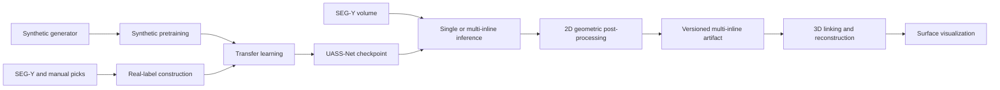

# Geometry-constrained deep learning for 3D thrust-fault interpretation

Code accompanying the manuscript:

> **Geometry-constrained deep learning for 3D thrust fault interpretation in seismic reflection data**  
> Wenhao Zheng, Rebecca E. Bell, Carlos Cueto, Lluis Guasch, Cédric M. John,
> Polina Pasalska, and Yanghua Wang

## Scope

This repository contains the current computational workflow for:

- synthetic thrust-fault data generation;
- construction of training labels from interpreted real seismic sections;
- UASS-Net synthetic pretraining and transfer learning;
- single- and multi-inline fault-probability inference;
- geometry-constrained 2D fault post-processing;
- cross-inline 3D fault linking and surface reconstruction; and
- visualization of current and legacy 3D surface products.

This is a source-code release with display-only demonstration material. It does
not distribute model checkpoints, SEG-Y volumes, manual interpretation CSV
files, legacy pickles, machine-readable demo exports, or survey-specific
real-label configurations. Users must provide compatible, appropriately
licensed inputs. See [`demo/README.md`](demo/README.md) for the distinction
between executable source and precomputed displays.

This is the core method repository, not a complete archive of every manuscript
figure, table, or quantitative analysis.

## Workflow



## Repository layout

```text
.
├── .gitignore
├── README.md
├── LICENSE
├── ASSET_LICENSES.md
├── MODEL_CARD.md
├── requirements.txt
├── synthetic_thrust_data_generation.py
├── real_seismic_label_construction.py
├── uassnet_training.py
├── fault_post_processing_2d.py
├── multi_inline_processing.py
├── fault_surface_reconstruction_3d.py
├── configs/
│   └── README.md
├── data/
│   ├── README.md
│   ├── segy/
│   └── interpretations/
├── demo/
│   ├── README.md
│   ├── fault_process_2d_end_to_end_github.ipynb
│   ├── fault_process_2d_end_to_end_github_executed.ipynb
│   ├── visualize_fault_surfaces_3d.py
│   └── figures/
│       ├── fault2d_demo_600/
│       │   └── *.png
│       └── fault3d_demo_400_500/
│           └── *.png
└── outputs/
    ├── README.md
    ├── datasets/
    │   ├── synthetic/
    │   └── real_labels/
    ├── training/
    ├── fault2d/
    ├── fault3d/
    └── visualization/
```

The six root-level Python files are the main computational stages.
`demo/visualize_fault_surfaces_3d.py` is an additional visualization CLI. The
source notebook is the executable inline-600 entry point; the `_executed`
notebook and `demo/figures/` are display-only references. See
[`demo/README.md`](demo/README.md).

## Path convention

Run commands from the repository root—the directory containing this README:

```bash
cd /path/to/repository
```

All documented relative paths, including paths embedded in configuration JSON
files, are interpreted from this working directory. See
[`data/README.md`](data/README.md), [`configs/README.md`](configs/README.md),
and [`outputs/README.md`](outputs/README.md) for the corresponding directory
contracts.

### External reference assets

| Path | Status | Purpose | SHA-256 |
|---|---|---|---|
| `model_real.pth` | External / not distributed | Historical reference UASS-Net state dictionary; see [MODEL_CARD.md](MODEL_CARD.md) | `d154ab68869cfc9c789b94835cb2614c182c7dd0fa3fd56cf2af4bb9b2b638aa` |
| `demo/outputs_400_500.pkl` | External / not distributed | Historical trusted legacy-grid viewer input | `bbac865f3eb57a1c27055bcdf2d2d52fd36f57fb89abe6a109cc2fed006fd1ca` |
| `data/segy/inline600.segy` | External / not distributed | Exact inline-600 notebook/regression input | `87ed66c6c91839661bf4a7a765175cbd332e0922ce85d63c09b44b91539ff785` |
| `data/segy/400_500.segy` | External / not distributed | SEG-Y context used to create the 3D display figures | `ca209ae7aec887a019b8aafc7f0f9ba240966e36f7e82b0876fb88c81e7e68cb` |
| `data/segy/<volume>.segy` | External / not distributed | Other single- or multi-inline inputs | Dataset-specific |
| `data/interpretations/<line>.csv` | External / not distributed | Manual fault interpretations | Dataset-specific |

Download the external seismic inputs from the
[project Google Drive data folder](https://drive.google.com/drive/folders/1MtPpidmfl3yWqn-X-P5Cn3K74hVw8g6S),
keep the documented filenames, and place the required SEG-Y files under
`data/segy/`. Verify the listed SHA-256 checksums before running the examples.
See [`data/README.md`](data/README.md) for placement details and
[`ASSET_LICENSES.md`](ASSET_LICENSES.md) for provenance and license terms.

No model checkpoint or legacy pickle is supplied or downloaded automatically.
Train a compatible checkpoint with the workflow below, or provide one obtained
from an authorized source. The filenames and hashes above identify historical
reference inputs; they do not grant a license or imply public availability.

SEG-Y and interpretation files under `data/` are intentionally ignored by Git.
New results under `outputs/` are also ignored. Alongside the demo source code,
only display PNGs and the precomputed display notebook are retained under
`demo/`; raw model, pickle, NPZ, CSV, and JSON artifacts are not distributed.

## Installation

The code requires Python 3.10 or newer. `requirements.txt` records the pinned
direct dependencies for the Python 3.11.5 reference environment; use Python
3.11 for the closest reproduction of that environment:

```bash
python -m venv .venv
source .venv/bin/activate
python -m pip install --upgrade pip
python -m pip install -r requirements.txt
```

The file pins the repository's direct Python dependencies, including notebook
support. It is not a complete lock of the operating system, GPU driver, CUDA
runtime, or every transitive dependency. Install the matching PyTorch 2.1.0
CPU or CUDA build first when a platform-specific wheel is required; its public
version must remain compatible with the pinned `torch==2.1.0` requirement.

## Quick checks without external data

Check the UASS-Net input/output contract on CPU:

```bash
python uassnet_training.py --mode sanity --device cpu
```

Expected summary:

```text
Input shape:  (2, 1, 256, 256)
Output shape: (2, 1, 256, 256)
Parameters:   5,789,423
```

Run the data-independent 3D formula and trajectory tests:

```bash
python fault_surface_reconstruction_3d.py --self-test
```

A successful run ends with:

```text
INFO All synthetic self-tests passed.
```

These checks validate internal interfaces only. They do not reproduce the
real-data manuscript results.

## 1. Generate synthetic data

First verify the array-axis contract with a deliberately non-square in-memory
sample:

```bash
python synthetic_thrust_data_generation.py --self-test
```

A successful run reports shape `(128, 96)` in `(x, z)` order. Then generate a
small on-disk interface dataset:

```bash
python synthetic_thrust_data_generation.py \
  --out outputs/datasets/synthetic_demo \
  --num-train 8 \
  --num-val 2 \
  --preview 2
```

Generate the manuscript-scale number of samples using the current generator
defaults:

```bash
python synthetic_thrust_data_generation.py \
  --out outputs/datasets/synthetic \
  --num-train 12000 \
  --num-val 2000
```

The output has the following training-data contract:

```text
outputs/datasets/synthetic/
├── config.json
├── train/
│   ├── seismic/*.npy
│   ├── labels/*.npy
│   └── metadata/*.json
└── val/
    ├── seismic/*.npy
    ├── labels/*.npy
    └── metadata/*.json
```

Every saved seismic and label array uses `(x, z)` order. `--width` sets `nx`,
`--height` sets `nz`, and the saved shape is `(width, height)`. `config.json`
and each sample metadata JSON explicitly record `array_axis_order: ["x", "z"]`.

Use a new or empty output directory for each dataset version. The generator
now refuses a directory containing an existing payload so that legacy `(z, x)`
samples cannot be mixed with current `(x, z)` samples. Existing synthetic data
created by an older version must be regenerated; do not reuse its synthetic or
transfer-learning checkpoints as evidence of the unified-axis training run.

## 2. Construct labels from real interpretations

Place SEG-Y files in `data/segy/`, CSV picks in `data/interpretations/`,
and create `configs/real_line_inputs.json`. For example:

```json
[
  {
    "inline_id": 30,
    "segy_path": "data/segy/30.segy",
    "csv_path": "data/interpretations/30.csv",
    "split": "train",
    "section_index": 0,
    "x_col": 0,
    "z_col": 1,
    "fault_id_col": 2,
    "x_offset": 800,
    "z_offset": 664,
    "x_scale": 1,
    "z_scale": 4,
    "label_shape_before_downsample": [3201, 1410],
    "downsample_x": 2,
    "downsample_z": 2
  },
  {
    "inline_id": 830,
    "segy_path": "data/segy/830.segy",
    "csv_path": "data/interpretations/830.csv",
    "split": "val",
    "section_index": 0,
    "x_col": 0,
    "z_col": 1,
    "fault_id_col": 2,
    "x_offset": 800,
    "z_offset": 664,
    "x_scale": 1,
    "z_scale": 4,
    "label_shape_before_downsample": [3201, 1410],
    "downsample_x": 2,
    "downsample_z": 2
  }
]
```

The coordinate values above illustrate the schema only. Verify offsets,
scales, column indices, section indices, and array shapes against the actual
interpretation data before running. A 3D `section_index` is strict and
zero-based; a 2D SEG-Y line accepts only `0`, so different configured identities
cannot silently resolve to the same physical section. The optional `split`
field assigns a whole inline to `train` or `val`; when it is used, assign every
configured inline.
If `split` is omitted, the builder still groups patches by complete inline and
selects the validation group deterministically from the configured seed. It
never randomly mixes overlapping patches from the same inline between the two
pools.

When only one inline produces usable patches, whole-inline holdout is
impossible. The builder automatically uses a contiguous spatial holdout with a
guard region between the training and validation footprints. Patches crossing
the split or guard boundary are discarded. The default `target_train=200` and
`target_val=40` values are upper limits applied after the safe pools have been
formed; a smaller pool is not supplemented from the other side merely to reach
those numbers.

Use a new output directory, or one containing only its committed `.gitignore`.
The builder refuses an existing generated payload so that stale patches from a
previous split cannot be consumed accidentally:

```bash
python real_seismic_label_construction.py \
  --config-json configs/real_line_inputs.json \
  --out outputs/datasets/real_labels \
  --preview
```

The leakage barriers can be checked without downloading seismic data:

```bash
python real_seismic_label_construction.py --self-test-split
```

Expected output:

```text
Split self-test passed: inline isolation, spatial guard, and overlap assertion.
```

The generated dataset includes:

```text
outputs/datasets/real_labels/
├── dataset_manifest.json
├── patch_manifest.csv
├── line_metadata.json
├── label_patch_config.json
├── train/
│   ├── seismic/
│   ├── labels/
│   └── metadata/
└── val/
    ├── seismic/
    ├── labels/
    └── metadata/
```

`patch_manifest.csv` maps every saved patch to its split, source inline,
spatial footprint, output paths, and checksums. `dataset_manifest.json` records
the resolved split strategy, input identities and checksums, parameters,
requested upper limits, actual counts, and discarded boundary patches. The
`train/seismic`, `train/labels`, `val/seismic`, and `val/labels` directories
match the input contract of `uassnet_training.py`. Use `.npy` for the current
end-to-end training path. Within each split, every seismic filename stem must
have an exactly matching label stem; the training loader rejects missing or
extra counterparts instead of pairing independently sorted lists.

## 3. Train UASS-Net

Synthetic pretraining:

```bash
python uassnet_training.py \
  --mode synthetic \
  --data-root outputs/datasets/synthetic \
  --out-dir outputs/training
```

The best checkpoint is written to
`outputs/training/uassnet_synthetic_best.pth`.

Transfer learning on the constructed real-label dataset:

```bash
python uassnet_training.py \
  --mode transfer \
  --data-root outputs/datasets/real_labels \
  --out-dir outputs/training \
  --pretrained outputs/training/uassnet_synthetic_best.pth
```

The best transfer checkpoint is
`outputs/training/uassnet_transfer_best.pth`. Transfer mode requires an
explicit checkpoint through `--pretrained`. The optional `--freeze-encoder`
flag is accepted only for transfer learning after that checkpoint is supplied.

## 4. Run single-inline 2D inference and post-processing

### Illustrated notebook

The source notebook expects the exact historical reference checkpoint named
`model_real.pth` in the repository root and the exact historical reference
SEG-Y at `data/segy/inline600.segy`. It verifies both files against the recorded
SHA-256 identities, so a newly trained compatible checkpoint cannot substitute
for the reference checkpoint in this regression notebook. Both files are
ignored by Git and are not part of this release. After placing those exact
local inputs, launch:

```bash
python -m notebook demo/fault_process_2d_end_to_end_github.ipynb
```

The notebook automatically locates the repository root and reads:

```text
model_real.pth
data/segy/inline600.segy
```

It can be launched with the kernel working directory set to either the
repository root or `demo/`. The separate
`demo/fault_process_2d_end_to_end_github_executed.ipynb` retains a precomputed
display of the historical run. It does not contain the model or SEG-Y input,
and exact reproduction is not possible unless both external files match the
recorded reference SHA-256 identities exactly. See
[`demo/README.md`](demo/README.md).

### Command-line interface

```bash
python fault_post_processing_2d.py \
  data/segy/inline600.segy \
  outputs/training/uassnet_transfer_best.pth \
  --inline 600 \
  --crossline-stride 2 \
  --sample-stride 2 \
  --device auto \
  --output-npz outputs/fault2d/inline600.npz
```

The command above uses the user-trained checkpoint produced in section 3. A
separately obtained compatible checkpoint may be substituted. Add
`--validate-inline600-reference` only when using the exact historical SEG-Y and
checkpoint identities listed above. A single-inline NPZ is a standalone 2D
result; it is not the versioned multi-inline artifact consumed by the 3D CLI.

## 5. Process multiple inlines

The following example streams inlines 300–330 from a regular-grid volume.
Replace the SEG-Y filename and inline range with the actual input:

```bash
python multi_inline_processing.py \
  data/segy/test_300_400.segy \
  --model-weights outputs/training/uassnet_transfer_best.pth \
  --inline-origin 300 \
  --inline-start 300 \
  --inline-end 330 \
  --inline-step 1 \
  --crossline-stride 2 \
  --sample-stride 2 \
  --patch-shape 256 256 \
  --overlap 12 \
  --device auto \
  --expected-model-sha256 "" \
  --output-pickle outputs/fault2d/fault_lines_2d_300_330.pkl \
  --deterministic
```

This writes:

```text
outputs/fault2d/fault_lines_2d_300_330.pkl
outputs/fault2d/fault_lines_2d_300_330.metadata.json
```

The sidecar records the inline mapping, coordinate convention, parameters,
software versions, input provenance, counts, and pickle SHA-256. When using a
newly trained checkpoint, provide its digest with
`--expected-model-sha256 DIGEST`. The example intentionally disables the
historical reference-model identity check because it uses a user-trained
checkpoint; record that checkpoint's digest and provenance separately.

## 6. Reconstruct 3D fault surfaces

Use the paired pickle and automatically discovered metadata sidecar produced by
the multi-inline stage:

```bash
python fault_surface_reconstruction_3d.py \
  outputs/fault2d/fault_lines_2d_300_330.pkl \
  --output-dir outputs/fault3d/fault3d_output_300_330 \
  --allow-unsafe-pickle
```

The output directory must be new or empty. Principal outputs are:

| File | Contents |
|---|---|
| `candidate_scores.csv` | Evaluated cross-inline candidate pairs and scores |
| `selected_links.csv` | Links retained after best-match selection |
| `track_membership.csv` | 2D line membership of validated tracks |
| `tracks.json` | Track topology and link statistics |
| `fault_surfaces.npz` | Non-object vertices, faces, offsets, and grid shapes |
| `run_metadata.json` | Parameters, provenance, coordinate notes, and output schema |

## 7. Use the legacy viewer with local inputs

The visualization CLI retains support for trusted, already-gridded legacy
surface pickles. No legacy pickle, normalized NPZ, CSV inventory, or JSON
metadata is distributed in this repository. A legacy surface pickle is an
input to the viewer below and must not be passed to
`fault_surface_reconstruction_3d.py`.

After supplying a trusted local pickle and placing the matching SEG-Y volume at
`data/segy/400_500.segy`, run:

```bash
python demo/visualize_fault_surfaces_3d.py \
  /path/to/trusted_legacy_surfaces.pkl \
  --input-format legacy-grid-pickle \
  --allow-legacy-pickle \
  --segy data/segy/400_500.segy \
  --inline-origin 400 \
  --crossline-stride 2 \
  --sample-stride 2 \
  --z-field grid_z \
  --vertical-unit m \
  --inline-slices 400 450 500 \
  --output-dir outputs/visualization/fault3d_demo_400_500
```

Display-only PNG examples from the historical workflow are under
`demo/figures/fault3d_demo_400_500/`. They are not substitutes for the omitted
pickle, SEG-Y, NPZ, CSV, or JSON inputs and products. New viewer outputs are
written under `outputs/visualization/`. See
[`demo/README.md`](demo/README.md) for the demo artifact boundary.

## Coordinate and artifact conventions

- Training seismic and label arrays use `(x, z)` order; network tensors use
  `(batch, channel, x, z)`. The synthetic generator converts its internal
  `(z, x)` simulation grid at the public output boundary.
- 2D point columns are processed-array indices in
  `(profile_index, sample_index)` order, not SEG-Y header coordinates.
- Multi-inline pickle root keys use `line_<index>`; the JSON sidecar is the
  authoritative mapping from those indices to SEG-Y inline numbers.
- Reconstructed surface vertices are stored as
  `(inline_number, processed_profile_pixel, processed_sample_pixel)`.
- Axis scaling affects 3D matching but does not convert exported vertices to
  physical survey coordinates.
- Pickle loading can execute arbitrary code. Use `--allow-unsafe-pickle` only
  for locally generated or otherwise trusted artifacts. A matching hash proves
  integrity, not authorship.

## Display-only figures and validation status

Included display material:

- `demo/figures/fault2d_demo_600/`: nine 2D workflow PNGs;
- `demo/figures/fault3d_demo_400_500/`: 3D/map and inline-overlay PNGs; and
- `demo/fault_process_2d_end_to_end_github_executed.ipynb`: a precomputed
  display notebook without its external checkpoint or SEG-Y input.

The repository does not include the raw legacy pickle or generated NPZ, CSV,
or JSON demo products.

Checked for this snapshot:

- all seven CLI entry points parse `--help`;
- the UASS-Net CPU sanity check passes;
- the 3D synthetic self-tests pass;
- both notebook JSON structures are valid, and the display notebook retains the
  historical image outputs; and
- no obsolete script names or machine-specific absolute paths remain in the
  current code examples.

The full 14,000-sample generation, real-label construction, 66/50-epoch
training, real-data inference, multi-inline inference, and complete 3D demo
were not rerun during the latest path-layout update because the external input
files are not present under `data/`.

## Citation

Please cite the associated manuscript when using this code:

```text
Zheng, W., Bell, R. E., Cueto, C., Guasch, L., John, C. M., Pasalska, P.,
and Wang, Y. Geometry-constrained deep learning for 3D thrust fault
interpretation in seismic reflection data. Manuscript submitted to
JGR: Machine Learning and Computation.
```

Replace this entry with the final publication year and DOI when available.

## Licensing

The source code and software documentation are licensed under the
[MIT License](LICENSE), copyright (c) 2026 Wenhao Zheng. This software license
does not automatically apply to model checkpoints, external seismic data,
manual interpretations, legacy pickles, or display-only derived material.
Wenhao Zheng has confirmed that he independently created the included
interpretation geometry and has not assigned or transferred those rights. The
included notebook outputs and PNG display assets are separately released under
[CC BY-NC-SA 3.0 US](https://creativecommons.org/licenses/by-nc-sa/3.0/us/),
subject to the NZ3D attribution and modification notices documented in
[ASSET_LICENSES.md](ASSET_LICENSES.md). Model weights remain external and have
no asserted redistribution or reuse license.
